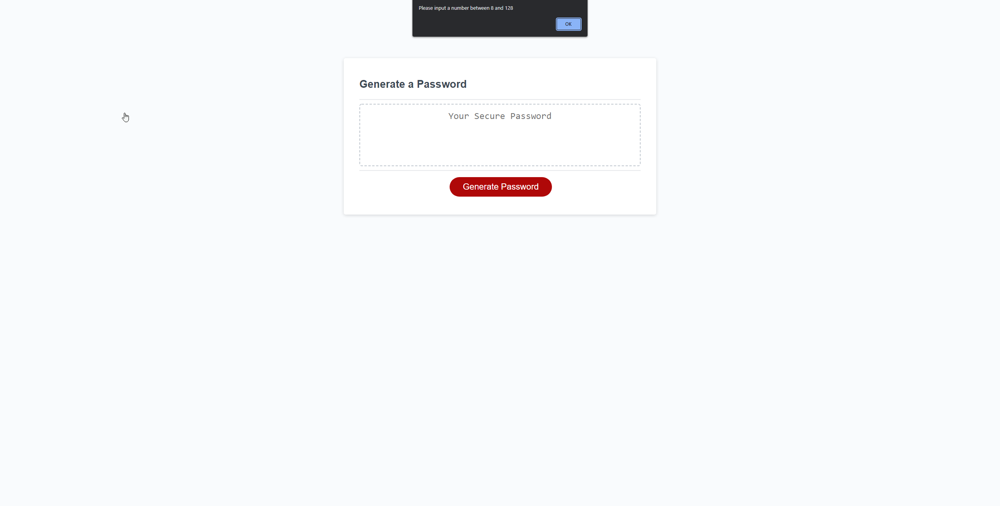
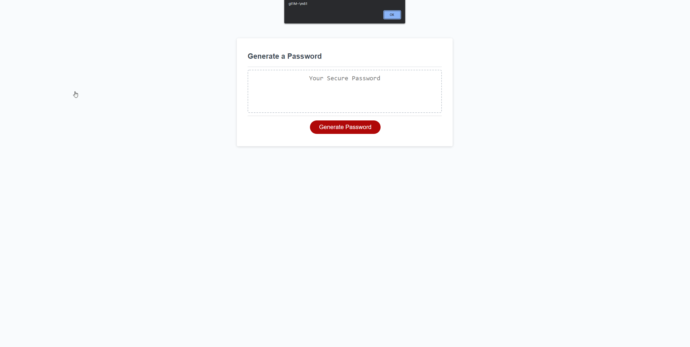

# random-password
This module challenge is focused on creating a series of functions in javascript in order to generate a password based on the user's specifications. 

When the 'generate password' button is clicked, the user will be prompted to type in how many characters they want the password to be. After a number betweeen 8 and 128 is types, they will face a series of 'confirm' boxes and most select at least one of the questions to include lowercase, uppercase, numbers, or special characters in their password. Once they've completed this, they will receive an alert with their randomly generated password.

Repo Link : https://github.com/SThevenot/random-password
Deployed Link : https://sthevenot.github.io/random-password/

